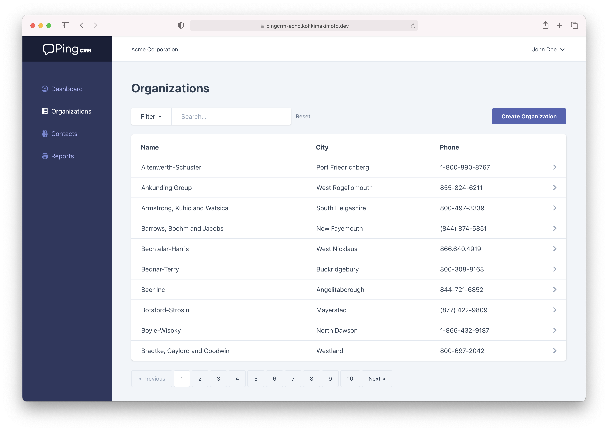

# Ping CRM on Echo (Go)

A demo application to illustrate how Inertia.js works with [inertia-echo](https://github.com/kohkimakimoto/inertia-echo).



This is a port of the original [Ping CRM](https://github.com/inertiajs/pingcrm) written in Laravel/PHP + Vue to [Echo](https://echo.labstack.com/)/Go + Vue.

## Demo

You can see the demo site at:

https://pingcrm-echo.kohkimakimoto.dev/

## Installation

You can download a precompiled binary at the Github releases page.

[Download latest version](https://github.com/kohkimakimoto/pingcrm-echo/releases/latest)

After extracting the archive file, you can run the binary with the following command.

```sh
pingcrm-echo -data-dir=<path to data storage directory you like>
```

You're ready to go! Open http://localhost:8080 in your browser, and login with:

- **Username:** johndoe@example.com
- **Password:** secret

## Build by Yourself

Clone the repo locally:

```sh
git clone https://github.com/kohkimakimoto/pingcrm-echo.git
cd pingcrm-echo
```

Install dependencies:


```sh
make deps
```

Build the binary:

```sh
make build/dev
```

You can get the binary at: `dev/build/outputs/dev/pingcrm-echo`.

## Credits

- Original work by Jonathan Reinink ([@reinink](https://github.com/reinink)) and contributors
- Port to Echo by Kohki Makimoto ([@kohkimakimoto](https://github.com/kohkimakimoto))
